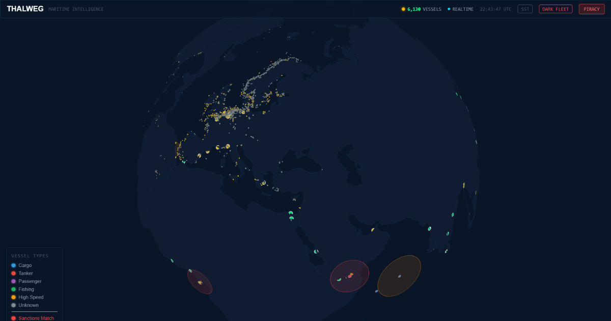

# Thalweg — Real-time Maritime Intelligence

[](https://thalweg.vercel.app)
[](./LICENSE)
[](https://nextjs.org)

Dark fleet detection. Sanctions monitoring. Spill prediction. 40,000+ live vessels.

> What Palantir charges $5M/year for, built in 7 weeks by one naval architecture student.
> Thalweg is open source under AGPL-3.0. It costs $0/month to run.

---

## Screenshot



*40,000+ live vessels. Red = sanctions match. Orange = anomaly detected. Yellow = dark fleet score >60.*

---

## Features

| Feature | Description | Data Source |
|---|---|---|
| Live Vessel Globe | 40,000+ vessels on interactive 3D globe | AISStream.io |
| Dark Fleet Detection | 0–100 risk score per vessel | AIS telemetry (multi-signal) |
| Sanctions Matching | Auto cross-reference per vessel | OpenSanctions (OFAC/EU/UN/UK) |
| AIS Anomaly Detection | Spoofing, loitering, dark periods | AISStream.io |
| Spill Risk & Trajectory | 24/48/72h drift polygons, PDF export | Copernicus Marine, NOAA |
| Port Congestion | Live vessel density at 50+ major ports | AISStream.io |
| Vessel Watch Alerts | Email alert on anomaly/sanctions hit | Resend + Supabase |
| AI Intelligence Briefs | Per-vessel narrative report on demand | Internal inference |
| Piracy Tracking | IMB incidents geocoded with risk zones | IMB Piracy Reporting Centre |
| Vessel Density Heatmap | Shipping lane visualization | AISStream.io |
| Sea Surface Temperature | Ocean condition overlay | Copernicus Marine Service |
| Demo Mode | 28 pre-seeded vessels, no live data required | — |

---

## Intelligence vs. Data

MarineTraffic and VesselFinder answer one question: where is this vessel right now? Thalweg answers the questions that follow. Why is this vessel here? Should it be here? Has it gone dark near a known ship-to-ship transfer zone? Does its declared flag, ownership chain, and recent port calls match its OFAC exposure? What happens to its cargo if it sinks in the next 72 hours?

The distinction matters operationally. A position feed is an input. Thalweg is the layer between raw AIS telemetry and an actionable intelligence picture — the same function performed by platforms costing hundreds of thousands of dollars annually, implemented transparently and available without a procurement cycle.

---

## Quick Start

### Local Development

```bash
git clone https://github.com/deringeorge-nebula/thalweg
cd thalweg
npm install
cp .env.example .env.local
# Fill in your environment variables (see below)
npm run dev
```

Open [http://localhost:3000](http://localhost:3000).

### Deploy to Vercel

[](https://vercel.com/new/clone?repository-url=https://github.com/deringeorge-nebula/thalweg)

One-click deploy. Set environment variables in the Vercel dashboard after cloning.

---

## Environment Variables

| Variable | Required | Description | Where to get it |
|---|---|---|---|
| `NEXT_PUBLIC_SUPABASE_URL` | Required | Supabase project URL | Supabase dashboard |
| `NEXT_PUBLIC_SUPABASE_ANON_KEY` | Required | Supabase anon key | Supabase dashboard |
| `MY_SERVICE_ROLE_KEY` | Required | Supabase service role key (server-side only) | Supabase dashboard → Settings → API |
| `UPSTASH_REDIS_REST_URL` | Required | Upstash Redis URL | upstash.com |
| `UPSTASH_REDIS_REST_TOKEN` | Required | Upstash Redis token | upstash.com |
| `RESEND_API_KEY` | Required | Email alerts via Resend | resend.com |
| `NEXT_PUBLIC_DEMO_MODE` | Optional | Set to `true` for demo with seeded vessels | — |

---

## Architecture

The decisions below are non-obvious and worth explaining explicitly.

**Partitioned position table.** `vessel_positions` is partitioned by month rather than stored in a single table. At 40,000+ vessels updating continuously, a monolithic table degrades under range queries. Monthly partitions keep index sizes bounded and allow old partitions to be dropped cleanly within the 6-hour rolling retention window.

**Float32Array with batch timer.** Vessel positions are buffered into a `Float32Array` and flushed to deck.gl on a 500ms timer, not stored in React state. Pushing 40,000 individual state updates per cycle would make the renderer unusable. The typed array feeds directly into the WebGL layer.

**No ORM.** The Supabase client is used directly with raw queries throughout. At this data volume, ORM abstraction layers introduce measurable latency with no offsetting benefit.

**Deno edge functions for intelligence.** Sanctions matching, dark fleet scoring, and anomaly detection run in Deno edge functions rather than Node.js API routes. This eliminates cold start penalties on the paths that matter most for latency.

**No authentication.** Thalweg is a public intelligence platform. Adding an auth layer would reduce the friction of evaluation and adoption with no corresponding security benefit — all intelligence is derived from public data sources.

---

## Tech Stack

| Layer | Technology | Why |
|---|---|---|
| Frontend | Next.js 14 App Router | SSR + edge middleware |
| Globe | deck.gl (GlobeView) | WebGL, 40,000+ points at 60fps |
| Database | Supabase (Postgres + Realtime) | Live updates + edge functions |
| Hosting | Vercel | Edge network, zero-config deploy |
| Rate Limiting | Upstash Redis | Serverless-compatible, 10 req/10s |
| Email | Resend | Transactional alerts, free tier |
| Intelligence | Deno Edge Functions | Low-latency, no cold start |

---

## API

All endpoints are public and rate-limited at 10 requests per 10 seconds via Upstash Redis.

| Endpoint | Method | Description |
|---|---|---|
| `/api/anomalies` | GET | Active anomalies list |
| `/api/darkfleet` | GET | Dark fleet vessel list |
| `/api/vessel/[mmsi]` | GET | Full vessel intelligence for MMSI |
| `/api/port/[locode]` | GET | Congestion data for a port |
| `/api/spill` | POST | Spill prediction for MMSI |
| `/api/watch` | POST | Add vessel watch (email alert) |
| `/api/watch` | DELETE | Remove vessel watch |

---

## Contributing

Thalweg is licensed under AGPL-3.0. The source code is available in full. Pull requests are welcome, particularly for:

- A more rigorous AIS gap vs. coverage-hole classifier (current heuristic conflates the two)
- Oil spill diffusion model improvement (current implementation uses a simplified Fay-Grotjahn spread; a stochastic particle model would improve 48/72h accuracy)
- Additional sanctions list sources beyond OFAC/EU/UN/UK
- Port berth capacity database (currently using vessel density as a proxy for congestion)

Please open an issue before starting significant work.

---

## Data Sources

| Source | Data | Update Frequency |
|---|---|---|
| AISStream.io | Real-time vessel telemetry (WebSocket) | Continuous |
| OpenSanctions | OFAC, EU Consolidated List, UN Security Council, UK sanctions | Daily sync |
| Global Fishing Watch | Fishing vessel activity, MPA violations | Near real-time |
| Copernicus Marine Service | Ocean currents, sea surface temperature | 6-hourly |
| IMB Piracy Reporting Centre | Incident database | As published |
| NOAA | Weather, wave height for spill modeling | Hourly |
| MarineRegions.org | EEZ and MPA boundaries | Static with periodic updates |

---

## Founder Note

This project was built from Visakhapatnam — India's primary eastern deep-water port and home to the Eastern Naval Command. A naval architecture program here is not an abstract context for a maritime software project; it means daily proximity to vessel draft restrictions, tidal windows, and the operational decisions that intelligence like this is meant to inform. The gap between what commercial maritime intelligence platforms cost and what a port authority, NGO, or independent analyst can actually afford is the specific problem Thalweg addresses. It was built in 7 weeks by one person. The codebase reflects that. Contributions are welcome.

---

## License

[AGPL-3.0](./LICENSE)

Commercial use requires either compliance with AGPL-3.0 (publishing all modifications) or a separate licensing arrangement.