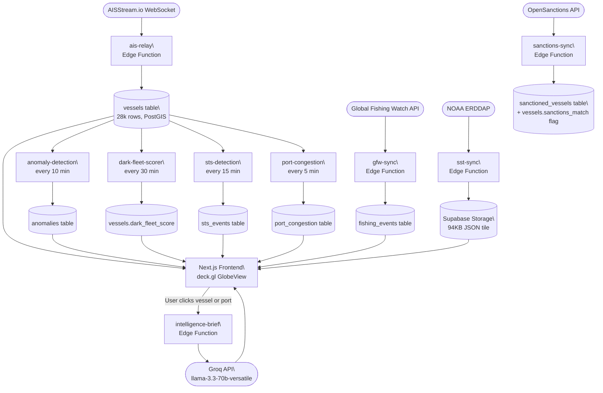

# Thalweg
### Free maritime intelligence. 29,547 vessels. Zero budget.


<!-- screenshot -->

I'm a third-year naval architecture student from Visakhapatnam. The tools that answer real maritime questions - sanctions screening, dark fleet detection, port congestion forecasting - cost $200,000 a year. Dryad Global. Windward. Built for governments and shipping conglomerates. I built Thalweg in 30 days, on a free tier, using only public data. It doesn't do everything they do. But it does more than most people expect from a student project with a zero budget.

The name is a river-mapping term. The thalweg is the line of deepest flow through a channel. It felt right.

---

## What it does

Thalweg pulls live AIS data, sanctions lists, fishing surveillance, sea surface temperatures, and piracy records into a single 3D globe. It runs anomaly detection and dark fleet scoring automatically, every few minutes, without any manual input.

Right now, live:

- **29,547 vessels** tracked in real time, positions updating in 500ms batches
- **43 sanctioned vessels** flagged against OFAC, EU, UN, and UK lists
- **16 dark fleet candidates** scored by behavioral pattern (highest: 79/100)
- **1,187 active anomalies** - AIS gaps, unexpected anchorages, flag changes, speed outliers
- **40 piracy incidents** mapped from 2024-2025 IMB/ICC-CCS reports
- **50 major ports** with 72-hour congestion forecasts (Rotterdam, Singapore, Shanghai, and 47 others)
- **40,000+ SST grid points** from NOAA updated daily
- **~1,000 fishing events/day** cross-referenced against Marine Protected Areas
- AI intelligence briefs generated in under 3 seconds via Groq

Click any vessel or port on the globe. You get a brief. It cites the anomaly data. It tells you what it doesn't know.

---

## The data

Everything comes from free public sources. No scraping. No terms-of-service violations.

| Source | What it provides | Update frequency |
|---|---|---|
| AISStream.io | Live vessel positions via WebSocket | Real-time (500ms batches) |
| OpenSanctions | Sanctions cross-reference: OFAC, EU, UN, UK | Daily sync |
| Global Fishing Watch API | Fishing events, MPA violations | Daily sync |
| NOAA ERDDAP OISST v2.1 | Sea surface temperature grid | Daily sync |
| IMB/ICC-CCS | Piracy incident database | Manual updates (2024-2025) |
| MarineRegions.org | EEZ boundaries, Marine Protected Areas | Static (versioned) |

---

## Architecture

AIS positions stream in over WebSocket, get batched every 500ms by `ais-relay`, and land in a Supabase `vessels` table with PostGIS geometry. From there, four scheduled edge functions run independently: `anomaly-detection` every 10 minutes, `dark-fleet-scorer` every 30 minutes, `sts-detection` every 15 minutes (ship-to-ship transfer detection), and `port-congestion` every 5 minutes. NOAA SST tiles and Global Fishing Watch events sync daily. The Next.js frontend reads everything through Supabase's Postgres API. When you request an intelligence brief, a single edge function assembles the vessel's full record and sends it to Groq. The response streams back in under 3 seconds.


---

## Quick start

You'll need Node.js 18+, a free Supabase account, a Groq API key, and an AISStream.io key. All free tier.

**1. Clone and install**
```bash
git clone https://github.com/deringeorge-nebula/thalweg.git
cd thalweg
npm install
```

**2. Set up environment variables**

Create a `.env.local` file at the project root:
```env
NEXT_PUBLIC_SUPABASE_URL=your_supabase_project_url
NEXT_PUBLIC_SUPABASE_ANON_KEY=your_supabase_anon_key
MY_SERVICE_ROLE_KEY=your_supabase_service_role_key
GROQ_API_KEY=your_groq_api_key
AISSTREAM_API_KEY=your_aisstream_api_key
```

**3. Set up Supabase**

In your Supabase project, go to the SQL editor (Dashboard > SQL Editor > New query) and run the contents of `supabase/schema.sql`. This creates all tables, PostGIS geometry columns, indexes, RPC functions, and pg_cron schedules.

Then deploy all nine edge functions:
```bash
npx supabase functions deploy ais-relay
npx supabase functions deploy port-congestion
npx supabase functions deploy sanctions-sync
npx supabase functions deploy gfw-sync
npx supabase functions deploy sst-sync
npx supabase functions deploy anomaly-detection
npx supabase functions deploy dark-fleet-scorer
npx supabase functions deploy sts-detection
npx supabase functions deploy intelligence-brief
```

Set the secrets the edge functions need:
```bash
npx supabase secrets set GROQ_API_KEY=your_key
npx supabase secrets set AISSTREAM_API_KEY=your_key
npx supabase secrets set MY_SERVICE_ROLE_KEY=your_key
```

**4. Run**
```bash
npm run dev
```

Open `http://localhost:3000`. The globe should load in a few seconds. Vessel data populates as the WebSocket fills the table. Give it 2-3 minutes before the picture is complete.

Total setup time: under 20 minutes if you don't run into Supabase's PostGIS setup (which occasionally needs a manual `CREATE EXTENSION postgis;` in the SQL editor).

---

## API

Public REST endpoints, rate limited at 60 requests per minute. No API key required.

**Vessel by MMSI**
```bash
curl https://thalweg.vercel.app/api/vessel/273267690
```
```json
{
  "vessel": {
    "mmsi": "273267690",
    "vessel_name": null,
    "flag_state": null,
    "type_category": "Unknown",
    "lat": 60.423,
    "lon": 28.157,
    "sog": 0.95,
    "dark_fleet_score": 79,
    "sanctions_match": true,
    "is_anomaly": true
  },
  "sanctions": {
    "confirmed": true,
    "enriched": false,
    "source": "vessels.sanctions_match flag (set by sanctions-sync)"
  },
  "anomalies": [
    {
      "anomaly_type": "DARK_VESSEL",
      "severity": "HIGH",
      "title": "Dark fleet candidate: 273267690",
      "description": "Vessel scored 79/100. Active signals: SANCTIONS_MATCH, AIS_DARK_615MIN, NEAR_SANCTIONED_EEZ, UNKNOWN_TYPE, NO_VESSEL_NAME.",
      "confidence": 0.79,
      "detected_at": "2026-03-22T18:54:20Z"
    }
  ],
  "sts_events": [],
  "meta": { "generated_at": "2026-03-22T22:20:46Z", "mmsi": "273267690" }
}
```

**Port by UN/LOCODE**
```bash
curl https://thalweg.vercel.app/api/port/SGSIN
```
```json
{
  "port": {
    "name": "Singapore",
    "country": "SG",
    "un_locode": "SGSIN",
    "annual_throughput_teu": 37200000,
    "max_berths": 67
  },
  "congestion": {
    "congestion_index": 33,
    "congestion_status": "ELEVATED",
    "active_vessel_count": 985,
    "predicted_congestion_24h": 33,
    "predicted_congestion_48h": 33,
    "predicted_congestion_72h": 33,
    "calculated_at": "2026-03-22T22:20:03Z"
  },
  "meta": { "data_freshness_seconds": 116, "locode": "SGSIN" }
}
```

**Active anomalies**
```bash
# severity options: LOW, MEDIUM, HIGH, CRITICAL
# type options: DARK_VESSEL, SPOOFING, SPEED_ANOMALY, STS_TRANSFER, MPA_VIOLATION, CASCADE
curl "https://thalweg.vercel.app/api/anomalies?severity=CRITICAL"
```
```json
{
  "anomalies": [
    {
      "anomaly_type": "DARK_VESSEL",
      "severity": "CRITICAL",
      "mmsi": "273250630",
      "title": "Dark vessel: BRATSK",
      "description": "BRATSK has been silent for 864 minutes (threshold: 120 min).",
      "confidence": 0.7,
      "detected_at": "2026-03-22T22:20:01Z"
    }
  ],
  "pagination": { "total": 45, "limit": 100, "offset": 0, "has_more": false },
  "meta": { "critical_count": 45, "high_count": 212 }
}
```

**Dark fleet candidates**
```bash
curl https://thalweg.vercel.app/api/darkfleet
```
```json
{
  "vessels": [
    {
      "mmsi": "273267690",
      "vessel_name": null,
      "dark_fleet_score": 79,
      "flag_state": null,
      "type_category": "Unknown",
      "sanctions_match": true,
      "is_anomaly": true,
      "last_update": "2026-03-22T08:39:22Z"
    }
  ],
  "count": 16,
  "score_distribution": { "critical": 2, "high": 14 },
  "meta": {
    "threshold": 60,
    "note": "Score computed from 9 signals: sanctions match (+40), AIS silence (+15), sanctioned EEZ proximity (+10), unknown type (+8), speed anomaly (+8), no vessel name (+6), stationary open ocean (+5), anchored open ocean (+5), heading unavailable (+3)."
  }
}
```

---

## Caveats

This is a research tool. It has real limitations worth knowing before you use it for anything important.

- **AIS coverage is incomplete offshore.** Terrestrial AIS receivers only reach 40-60 nautical miles from shore. Vessels in mid-ocean only appear via satellite AIS, which the free AISStream tier includes partially. There are genuine coverage gaps, especially in the South Atlantic and parts of the Indian Ocean.
- **Sanctions data is capped on the free tier.** The free OpenSanctions API returns matches against roughly 43 vessels right now. Upgrading to a full key would expand coverage to somewhere between 400 and 800 vessels. The matching logic is already there; it's a key tier issue.
- **Pattern-of-life fingerprinting is not live yet.** The dark fleet scorer uses behavioral signals (AIS gaps, STS proximity, flag history), but true pattern-of-life analysis needs 30 days of historical position data per vessel. The infrastructure is ready. The feature isn't.
- **Nothing here is certified or legally admissible.** Dryad and Windward produce intelligence products for legal proceedings and government briefings. Thalweg doesn't. It's an open research tool built on public data. Treat the outputs accordingly.

---

## License

AGPL-3.0. If you fork this and run it as a service, your modifications have to be open source too. That's the deal.

Full license text: LICENSE

---

## About

I'm a third-year naval architecture student from Visakhapatnam, India. I built Thalweg because I kept running into questions during my coursework that the free tools couldn't answer and the real tools cost more than my annual tuition times ten. There's no institution behind this. No lab funding. Just domain knowledge, public APIs, and about 30 days of evenings and weekends. If you work in maritime research and find this useful, or find something wrong with the detection logic, I'd genuinely like to hear from you.